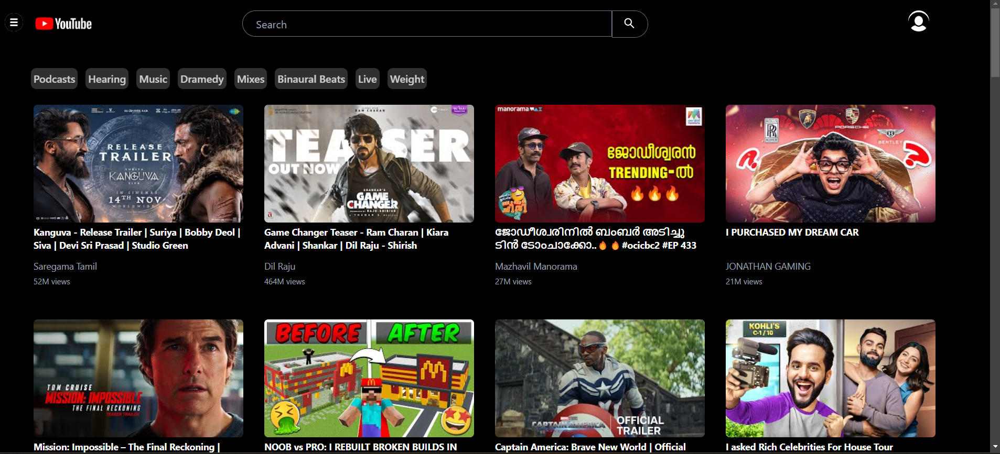
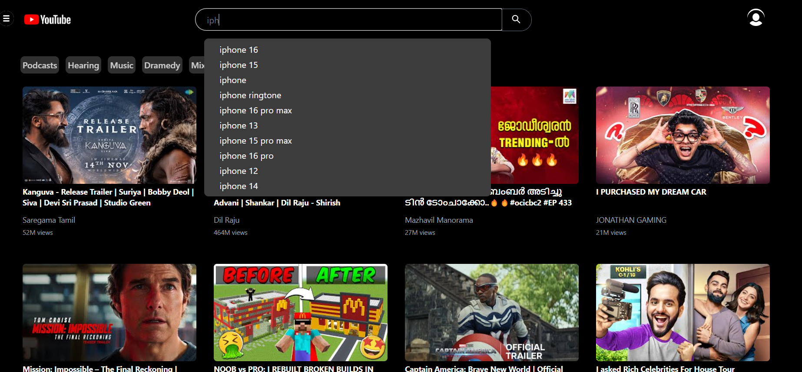
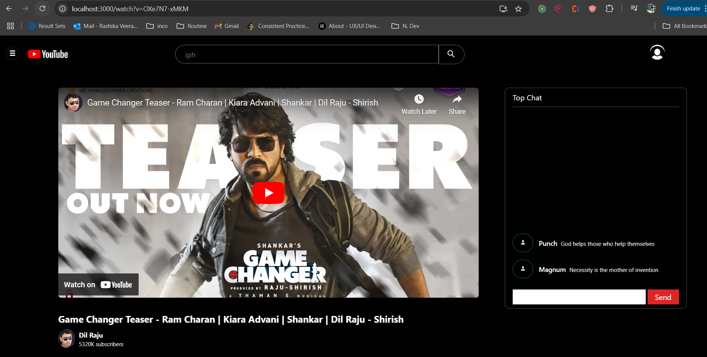
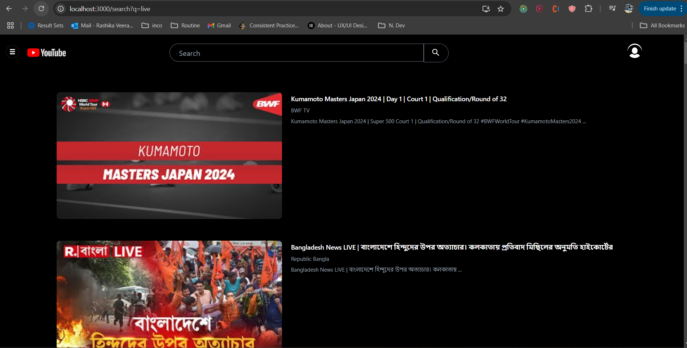

# YouTube Clone

A YouTube clone built with React, Tailwind CSS, Redux, and YouTube APIs. 

## Features

- **Search Bar with Autocomplete**: Integrated with Google Autocomplete API, featuring debouncing for smoother search experience.
- **LRU Cache for Search**: Implemented using Redux to cache recent search results and reduce redundant API calls.
- **Dynamic Routing**: Utilizes React Router with `createBrowserRouter` and `useSearchParams` for seamless page navigation.
- **Video Display and Search Page**: Renders videos based on user queries, with navigation to a search page displaying relevant results.
- **Watch Page**:
  - **Video Playback**: On selecting a video, users are taken to a dedicated page to watch it.
  - **Nested Comments**: Displays nested comments, simulating a comment hierarchy.
  - **Live Chat**: A simulated live chat feature with messages generated randomly using `setInterval` inside `useEffect`, dispatched to the Redux chat store.

## Tech Stack

- **React**: For building the user interface with reusable components.
- **Tailwind CSS**: For modern, responsive styling.
- **Redux**: Manages application state, especially useful for the LRU cache and chat store.
- **React Router**: Enables dynamic routing between pages.
- **YouTube Data API**: Fetches video data and search results.
- **Google Autocomplete API**: Suggests search queries as users type.

## Installation

1. **Clone the repository**:
   ```bash
   git clone <your-repo-url>
   ```
2. **Navigate to the project folder**:
   ```bash
    cd youtube-clone
   ```
3. **Install dependencies**:
   ```bash
   npm install
   ```
4. **Add API Keys**:
- **Create a .env file in the root directory.**
- **Add your Google Autocomplete and YouTube Data API keys:**
   ```bash
    REACT_APP_GOOGLE_AUTOCOMPLETE_API_KEY=your_google_api_key
   ```
5. **Run the application**
    ```bash
    npm start
    ```
## Usage
- **Search for Videos**: Type in the search bar to view autocomplete suggestions and search results.
- **Navigate to Video Page**: Click on a video thumbnail to access its watch page.
- **View Comments and Chat**s: Interact with the nested comments and simulated live chat feature on the video page.

## Screenshots
- **Home Page**


- **Search Bar with Autocomplete Suggestions**


- **Watch Page with Live API**


- **Search Page**
